## Architecture

The project is designed according to a modular, event-driven architecture where functionality is grouped together into like kind sub-classes, instances of which are then contained in a master class which itself is contained within the main class. To illustrate, let's look at the APICaller module contains all logic for calling funding rate data from the relevant APIs. This module contains two sub-classes `SynthetixCaller` and `BinanceCaller`, where all the logic for interacting with the respective APIs is stored in the corresponding sub-class. Then an instance of each class is stored within the `MasterCaller` class, which contains all functions that require access to both of these APIs, an example being reading and identifying funding rate discrepancies between the two.
This inheritance structure is repeated with the Master modules, an instance of each being created in the Main class. The Main class therefore contains instances of the following:
    - `MasterCaller`
    - `MatchingEngine`
    - `MasterPositionMonitor`
    - `MasterPositionController`
    - `TradeLogger`

Cross-module communication is handled via event emitters and listeners, a directory of which can be found in GlobalUtils.py.
Upon confirmation of execution, trades are logged to a database with each side (SNX/HMX) having its own entry, and are linked via a shared UUID. Upon closing, the entries are updated with relevant PnL, accrued funding and reason for close. 

```mermaid
flowchart TD
    %% Core Orchestrator
    subgraph "Core Orchestrator"
        Main["Main (Entry Point)"]:::main
    end

    %% Modules
    subgraph "Modules"
        direction TB
        APICaller["APICaller"]:::api
        MatchingEngine["MatchingEngine"]:::matching
        PositionMonitor["PositionMonitor"]:::monitor
        TxExecution["TxExecution"]:::execution
        Backtesting["Backtesting"]:::backtesting
        GlobalUtils["GlobalUtils"]:::utils
    end

    %% External Exchanges
    subgraph "External Exchanges"
        direction TB
        Binance["Binance"]:::exchange
        ByBit["ByBit"]:::exchange
        GMX["GMX"]:::exchange
        HMX["HMX"]:::exchange
        OKX["OKX"]:::exchange
        Perennial["Perennial"]:::exchange
        Synthetix["Synthetix"]:::exchange
    end

    %% Relationships
    Main --> APICaller
    Main --> MatchingEngine
    Main --> PositionMonitor
    Main --> TxExecution
    Main --> Backtesting
    Main --> GlobalUtils

    APICaller -->|"funding_data"| MatchingEngine
    MatchingEngine -->|"trade_signals"| PositionMonitor
    MatchingEngine -->|"trade_signals"| TxExecution

    APICaller -->|"api_calls"| Binance
    APICaller -->|"api_calls"| ByBit
    APICaller -->|"api_calls"| GMX
    APICaller -->|"api_calls"| HMX
    APICaller -->|"api_calls"| OKX
    APICaller -->|"api_calls"| Perennial
    APICaller -->|"api_calls"| Synthetix

    MatchingEngine -.->|"utilizes"| GlobalUtils
    PositionMonitor -.->|"logs_via"| GlobalUtils
    TxExecution -.->|"executes_using"| GlobalUtils

    %% Click Events
    click Main "https://github.com/50shadesofgwei/funding-rate-arbitrage/blob/main/Main/main_class.py"
    click APICaller "https://github.com/50shadesofgwei/funding-rate-arbitrage/blob/main/APICaller/master/MasterCaller.py"
    click Binance "https://github.com/50shadesofgwei/funding-rate-arbitrage/tree/main/APICaller/Binance/"
    click ByBit "https://github.com/50shadesofgwei/funding-rate-arbitrage/tree/main/APICaller/ByBit/"
    click GMX "https://github.com/50shadesofgwei/funding-rate-arbitrage/tree/main/APICaller/GMX/"
    click HMX "https://github.com/50shadesofgwei/funding-rate-arbitrage/tree/main/APICaller/HMX/"
    click OKX "https://github.com/50shadesofgwei/funding-rate-arbitrage/tree/main/APICaller/Okx/"
    click Perennial "https://github.com/50shadesofgwei/funding-rate-arbitrage/tree/main/APICaller/Perennial/"
    click Synthetix "https://github.com/50shadesofgwei/funding-rate-arbitrage/tree/main/APICaller/Synthetix/"
    click Backtesting "https://github.com/50shadesofgwei/funding-rate-arbitrage/tree/main/Backtesting/"
    click MatchingEngine "https://github.com/50shadesofgwei/funding-rate-arbitrage/blob/main/MatchingEngine/MatchingEngine.py"
    click PositionMonitor "https://github.com/50shadesofgwei/funding-rate-arbitrage/tree/main/PositionMonitor/"
    click TxExecution "https://github.com/50shadesofgwei/funding-rate-arbitrage/tree/main/TxExecution/"
    click GlobalUtils "https://github.com/50shadesofgwei/funding-rate-arbitrage/tree/main/GlobalUtils/"
    click Assets "https://github.com/50shadesofgwei/funding-rate-arbitrage/tree/main/Assets/"
    click Contributors "https://github.com/50shadesofgwei/funding-rate-arbitrage/blob/main/Contributors/README.md"

    %% Styles
    classDef main fill:#FFD700,stroke:#DAA520,stroke-width:2px
    classDef api fill:#ADD8E6,stroke:#0000FF,stroke-width:2px
    classDef matching fill:#FFFF99,stroke:#FFD700,stroke-width:2px
    classDef monitor fill:#FFA07A,stroke:#FF4500,stroke-width:2px
    classDef execution fill:#FFB6C1,stroke:#FF69B4,stroke-width:2px
    classDef backtesting fill:#D8BFD8,stroke:#DA70D6,stroke-width:2px
    classDef utils fill:#90EE90,stroke:#32CD32,stroke-width:2px
    classDef exchange fill:#E6E6FA,stroke:#8A2BE2,stroke-width:2px
    classDef doc fill:#F0E68C,stroke:#BDB76B,stroke-width:2px
```

